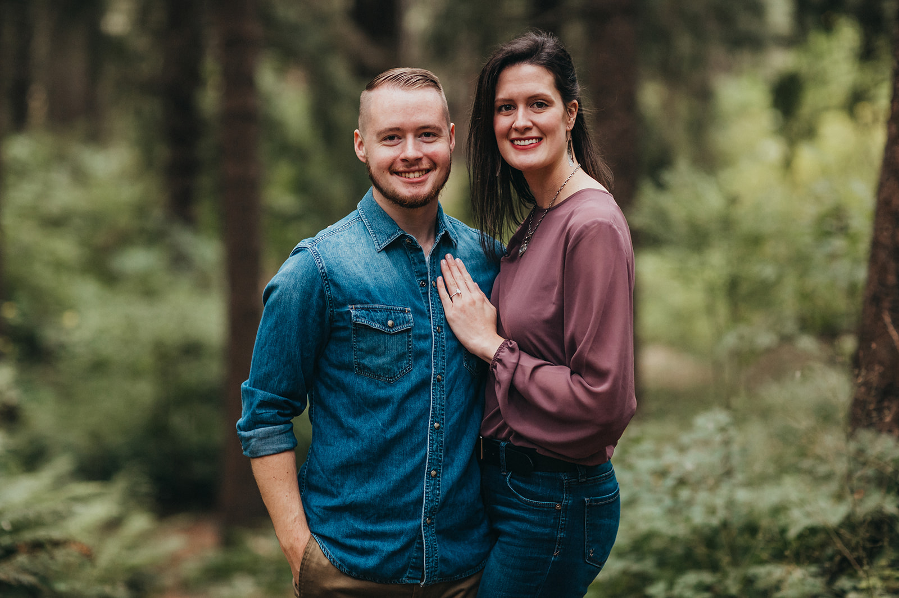

# _Personal Portfolio_ 

<h4><a href="https://jessedwhite.com/">www.jessedwhite.com</a></h4>
<h3><em >This is a personal portfolio created to be a reflection of me and my drives.</em></h3>
<h4>
By Jesse White
</h4>

## Technologies Used
* 📝 _HTML_
* ☕ _Javascript_
* 🧭 _Node.js_
* Ⓜ️ _Material UI_
* ⚛️ _React_
## 📜 Description
_I wanted a splash page to host all of my projects of note, experience, and drive in one place. This site is a constant work in progress but is a great reflection of me._
### 💻 Prerequisites
* [Node](https://nodejs.org/en/)
* A text editor like [VS Code](https://code.visualstudio.com/)
## 🏗 Setup/Installation Requirements
1. Clone the repository: `$ git clone https://github.com/JesseDWhite/Portfolio`.
2. Navigate to the `Portfolio/` directory on your computer.
3. Open with your preferred text editor to view the code base.
4. To start a development server and view the project in the browser:
    * _Navigate to `Portfolio/` in your command line_
    * _Run the command `npm install` to install dependencies_
    * _Optionally, run the command `npm run build` to make a bundle of the files_
    * _Finally, run the command `npm run start` to start a development server_
## 🐛 Known Bugs
* _Application is not optimized for mobile yet._
## ⚖ License
_MIT © 2021 Jesse White_
## 🤳 Contact Information
Jesse White _jesse.white6@gmail.com_